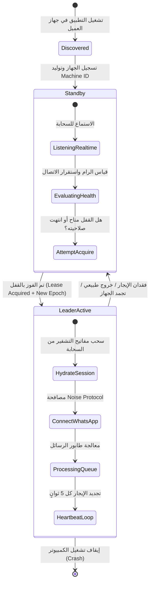
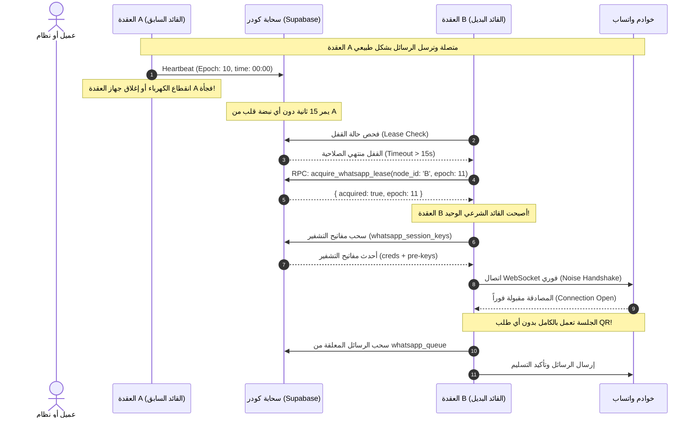

# Implementation Plan: Decentralized WhatsApp Cluster & Seamless Failover
# خطة المعمارية والتنفيذ التفصيلية لعنقود الواتساب اللامركزي

**Feature Code**: `PLAN-002-WA-CLUSTER`  
**Date**: 2026-09-25  
**Specification**: [spec.md](./spec.md)  
**Status**: In Implementation Planning  

---

## 1. Architectural Decision Records (ADRs)

### ADR-01: الترقية إلى محرك Baileys Socket بدلاً من Puppeteer
* **القرار**: استبدال مكتبة `whatsapp-web.js` بمكتبة `@whiskeysockets/baileys`.
* **الدافع**:
  1. محرك Puppeteer يتطلب تشغيل متصفح كامل (Chromium)، مما يستهلك 600MB من الرام ويستغرق 25 ثانية للإقلاع، وحجم ملفه 115MB.
  2. مكتبة Baileys تتصل مباشرة ببروتوكول Multi-Device عبر WebSockets و Protobuf. تستهلك فقط 40MB رام، وحجم ملفها لا يتجاوز 15MB، وتقلع في أقل من ثانيتين.
  3. إنهاء مشاكل تعليق أجهزة العملاء وفحص Windows Defender للملفات الضخمة بصورة نهائية.

### ADR-02: حفظ الجلسة كمفاتيح تشفير متزامنة (Cloud Auth State Adapter)
* **القرار**: بناء محول مصادقة سحابي مخصص (`useCloudAuthState`) يقوم بتخزين وقراءة مفاتيح Baileys التشفيرية (`creds.json` ومفاتيح `pre-keys` و `session-keys`) مباشرة في قاعدة البيانات.
* **الدافع**:
  1. جلسة Baileys بالكامل لا تتجاوز 400 كيلوبايت (مقارنة بـ 100 ميجابايت لملفات المتصفح).
  2. تخزين المفاتيح بشكل ذري ومشفر في جدول `whatsapp_session_keys` يتيح لأي عقدة استعادة الجلسة في أجزاء من الثانية بمجرد انتخابها قائداً.
  3. حماية الجلسة من التلف عند الإغلاق المفاجئ لجهاز القائد؛ حيث تكون جميع المفاتيح محفوظة بالفعل في السحابة.

### ADR-03: منع الـ Split-Brain عبر عقود الإيجار الرقمية (Fenced Leases & Epochs)
* **القرار**: تطبيق بروتوكول تأجير زمني مؤقت مع رقم دورة تصاعدي (`epoch_token`).
* **الدافع**:
  1. إذا اتصل جهازان بنفس حساب واتساب في نفس اللحظة، تقوم شركة Meta فوراً بفك الارتباط (Revoke Session).
  2. عقد الإيجار يضمن ألا يتصل أي جهاز بواتساب إلا إذا كان يمتلك القفل النشط ومؤكداً من السحابة.
  3. إذا تجمد جهاز القائد واستيقظ لاحقاً، يكتشف فوراً أن رقم دورتها (`epoch`) قديم، فينسحب فوراً دون لمس اتصال واتساب.

### ADR-04: الالتزام الصارم بدستور كودر (Zero Supabase Storage Footprint)
* **القرار**: منع استخدام Supabase Storage نهائياً في ملفات الجلسات أو التحديثات.
* **الدافع**:
  1. دستور المشروع (Constitution - Section 25) يمنع استهلاك Storage للملفات الباينارية لحماية الكوتة المجانية.
  2. تخزين المفاتيح المشفرة JSONB داخل جداول Postgres المشفرة لا يستهلك سوى بضعة كيلوبايتات فقط ولا يخضع لقيود Storage.

---

## 2. System Architecture & Topology

```
                                  ┌────────────────────────────────────────┐
                                  │      WhatsApp Multi-Device Servers     │
                                  │       (wss://web.whatsapp.com)         │
                                  └───────────────────▲────────────────────┘
                                                      │ Encrypted WebSocket
                                                      │ (Only LEADER connects)
                                                      │
                       ┌──────────────────────────────┴──────────────────────────────┐
                       │                                                             │
        ┌──────────────┴──────────────┐                               ┌──────────────┴──────────────┐
        │   Node A (Client 1 PC)      │                               │   Node B (Client 2 PC)      │
        │   ★ Role: LEADER            │                               │   ○ Role: STANDBY           │
        ├─────────────────────────────┤                               ├─────────────────────────────┤
        │ - Baileys Socket: CONNECTED │                               │ - Baileys Socket: IDLE      │
        │ - Lease: Active (Epoch: 42) │                               │ - Lease: Watching           │
        │ - Heartbeat: Every 5s       │                               │ - Health Score: 98/100      │
        │ - Outbound Queue: Processing│                               │ - Ready for Failover        │
        └──────────────┬──────────────┘                               └──────────────┬──────────────┘
                       │                                                             │
                       │ Outbound HTTPS/WSS                                          │ Outbound HTTPS/WSS
                       │ (No Ports Needed)                                           │ (No Ports Needed)
                       │                                                             │
                       ▼                                                             ▼
┌──────────────────────────────────────────────────────────────────────────────────────────────────┐
│                                    SUPABASE CLOUD PLATFORM                                       │
├────────────────────────────────┬───────────────────────────────┬─────────────────────────────────┤
│    Postgres Database           │     Supabase Realtime         │       Distributed State         │
│  - system_settings (Lease)     │  - system_settings changes    │  - whatsapp_session_keys        │
│  - whatsapp_queue (Messages)   │  - whatsapp_nodes presence    │    (Encrypted AES-GCM-256)      │
│  - whatsapp_nodes (Health)     │  - Fast Failover Notification │  - Total Payload: < 500 KB      │
└────────────────────────────────┴───────────────────────────────┴─────────────────────────────────┘
```

---

## 3. Distributed Consensus & Failover State Machine

### 3.1 دورة حياة العقدة (Node Lifecycle):



### 3.2 سيناريو الانتقال الفوري للقيادة عند سقوط القائد (Failover Sequence):



---

## 4. The Cloud Auth State Engine (`useCloudAuthState`)

في محرك Baileys، يتمثل ملف المصادقة في واجهة `AuthenticationState`:
```typescript
interface AuthenticationState {
    creds: AuthenticationCreds;
    keys: SignalKeyStore;
}
```

### 4.1 آلية المزامنة اللحظية الذرية:
1. **عند مسح الـ QR أول مرة**:
   يقوم القائد باستقبال `creds.update`، فيقوم بتشفيرها بـ `AES-256-GCM` وحفظها في جدول `whatsapp_session_keys` تحت `key_type = 'creds'`.
2. **أثناء المراسلة وتدوير المفاتيح (Key Rotation)**:
   تقوم الدالة `keys.set(data)` بتحديث المفاتيح السحابية فور ورودها من واتساب بصيغة دفعات متزامنة (Batched Writes) لتقليل استدعاءات الشبكة وضمان عدم فقدان أي مفتاح.
3. **عند بدء القائد الجديد**:
   يقوم المحول بقراءة كافة المفاتيح من `whatsapp_session_keys`، وفك تشفيرها محلياً في الذاكرة وإمداد محرك Baileys بها، مما يجعله يستأنف الجلسة وكأنه لم ينقطع قط!

---

## 5. Database Schema & Migration Specification

### 5.1 جداول إدارة العنقود والمفاتيح:

```sql
-- 1. جدول قنوات واتساب (يدعم عزل الشركات أو عنقود النظام المشترك)
CREATE TABLE IF NOT EXISTS public.whatsapp_channels (
    id UUID PRIMARY KEY DEFAULT gen_random_uuid(),
    company_id UUID REFERENCES public.companies(id) ON DELETE CASCADE,
    channel_name TEXT NOT NULL DEFAULT 'Main Channel',
    phone_number TEXT,
    status TEXT DEFAULT 'disconnected', -- 'disconnected', 'qr_pending', 'connected'
    active_leader_id TEXT,
    current_epoch BIGINT DEFAULT 1,
    lease_expires_at TIMESTAMPTZ,
    last_qr_code TEXT,
    created_at TIMESTAMPTZ DEFAULT clock_timestamp(),
    updated_at TIMESTAMPTZ DEFAULT clock_timestamp()
);

-- 2. جدول مفاتيح التشفير للجلسة (بديل Supabase Storage - خفيف وآمن)
CREATE TABLE IF NOT EXISTS public.whatsapp_session_keys (
    channel_id UUID NOT NULL REFERENCES public.whatsapp_channels(id) ON DELETE CASCADE,
    key_type TEXT NOT NULL, -- 'creds', 'pre-key', 'session', 'sender-key', 'app-state'
    key_id TEXT NOT NULL,
    key_data TEXT NOT NULL, -- Encrypted JSON payload (AES-256-GCM)
    updated_at TIMESTAMPTZ DEFAULT clock_timestamp(),
    PRIMARY KEY (channel_id, key_type, key_id)
);

CREATE INDEX IF NOT EXISTS idx_wa_keys_lookup 
ON public.whatsapp_session_keys(channel_id, key_type);

-- 3. جدول عقد العنقود (Cluster Nodes)
CREATE TABLE IF NOT EXISTS public.whatsapp_nodes (
    id TEXT PRIMARY KEY, -- Machine Unique ID
    company_id UUID REFERENCES public.companies(id) ON DELETE SET NULL,
    hostname TEXT,
    os_info TEXT,
    ip_address TEXT,
    status TEXT DEFAULT 'standby', -- 'leader', 'standby', 'offline'
    is_leader BOOLEAN DEFAULT false,
    health_score INT DEFAULT 100,
    memory_usage_mb INT,
    uptime_seconds BIGINT,
    last_heartbeat TIMESTAMPTZ DEFAULT clock_timestamp(),
    created_at TIMESTAMPTZ DEFAULT clock_timestamp()
);
```

### 5.2 إجراءات التحكم الذرية (Atomic RPC Functions):

```sql
-- 4. حجز عقد الإيجار القيادي ومنع التضارب (Atomic Lease Acquisition)
CREATE OR REPLACE FUNCTION public.acquire_whatsapp_lease(
    p_node_id TEXT,
    p_channel_id UUID,
    p_lease_duration_seconds INT DEFAULT 15,
    p_health_score INT DEFAULT 100
)
RETURNS JSONB
LANGUAGE plpgsql
SECURITY DEFINER
AS $$
DECLARE
    v_channel RECORD;
    v_now TIMESTAMPTZ := clock_timestamp();
    v_new_epoch BIGINT;
BEGIN
    SELECT * INTO v_channel
    FROM whatsapp_channels
    WHERE id = p_channel_id
    FOR UPDATE;

    IF NOT FOUND THEN
        RETURN jsonb_build_object('acquired', false, 'error', 'channel_not_found');
    END IF;

    -- شروط الاستحواذ على القيادة:
    -- 1. العقدة نفسها تملك القفل وتجدده
    -- 2. القفل شاغر (active_leader_id IS NULL)
    -- 3. عقد الإيجار منتهي الصلاحية (lease_expires_at < v_now)
    IF v_channel.active_leader_id = p_node_id 
       OR v_channel.active_leader_id IS NULL 
       OR v_channel.lease_expires_at IS NULL 
       OR v_channel.lease_expires_at < v_now THEN
       
        v_new_epoch := COALESCE(v_channel.current_epoch, 0) + 1;

        UPDATE whatsapp_channels
        SET active_leader_id = p_node_id,
            current_epoch = v_new_epoch,
            lease_expires_at = v_now + (p_lease_duration_seconds || ' seconds')::INTERVAL,
            updated_at = v_now
        WHERE id = p_channel_id;

        -- تحديث حالة العقدة
        UPDATE whatsapp_nodes
        SET is_leader = true,
            status = 'leader',
            health_score = p_health_score,
            last_heartbeat = v_now
        WHERE id = p_node_id;

        RETURN jsonb_build_object(
            'acquired', true,
            'epoch', v_new_epoch,
            'expires_at', v_now + (p_lease_duration_seconds || ' seconds')::INTERVAL,
            'role', 'leader'
        );
    ELSE
        -- القفل لا يزال مشغولاً بواسطة قائد نشط
        RETURN jsonb_build_object(
            'acquired', false,
            'current_leader', v_channel.active_leader_id,
            'expires_at', v_channel.lease_expires_at,
            'role', 'standby'
        );
    END IF;
END;
$$;
```

---

## 6. Anti-Ban Engine & Message Throttling

لحماية رقم الشركة من خوارزميات الحظر التلقائي لدى واتساب، يُطبق النظام المحاور التالية:

1. **Jittered Interval**: فاصل زمني عشوائي بين الرسائل يتراوح من 2.5 ثانية إلى 6 ثوانٍ.
2. **Presence Simulation**: محاكاة سلوك المستخدم البشري بإرسال حالة "متصل" ثم `sendPresenceUpdate('composing')` لمدة 1.5 ثانية قبل إرسال الرسالة.
3. **Smart Priority Queueing**:
   - `Priority 10`: رسائل التحقق (OTP) والتنبيهات الأمنية (تُرسل فورياً).
   - `Priority 5`: إشعارات تسجيل الحضور وقسائم الرواتب الفردية.
   - `Priority 1`: التقارير اليومية والرسائل الإدارية المجدولة.
4. **Auto Circuit Breaker**: في حال استقبال خطأ `429 Too Many Requests` أو انقطاع غير معتاد، يتوقف الطابور مؤقتاً لمدة 60 ثانية لحماية الحساب.

---

## 7. Zero-Touch Integration with KWADER Sync Agent

1. **حزمة مدمجة فائقة الخفة**:
   يتم تضمين الخدمة كملف `whatsapp-node.exe` مدمج داخل `dist/_internal/bin/` بحجم لا يتجاوز 15MB.
2. **التشغيل بالخلفية بدون شاشات سوداء**:
   يتم تعديل الـ PE Subsystem للملف إلى `GUI (Subsystem 2)` لضمان عدم ظهور أي نافذة طرفية تشتت العميل.
3. **التشغيل الذاتي مع إقلاع الجهاز**:
   يقوم مثبت البرنامج (NSIS Installer) بإنشاء مفتاح في سجل ويندوز (`HKCU\Software\Microsoft\Windows\CurrentVersion\Run`) للتشغيل التلقائي.
4. **مراقب الأعطال الذكي (Crash Watchdog)**:
   يقوم برنامج بايثون (`app.py`) بفحص حالة العملية كل 3 ثوانٍ؛ وفي حال توقفها يقوم بإعادة إطلاقها فوراً وتدوين الحالة في سجل UTF-8 الآمن.
